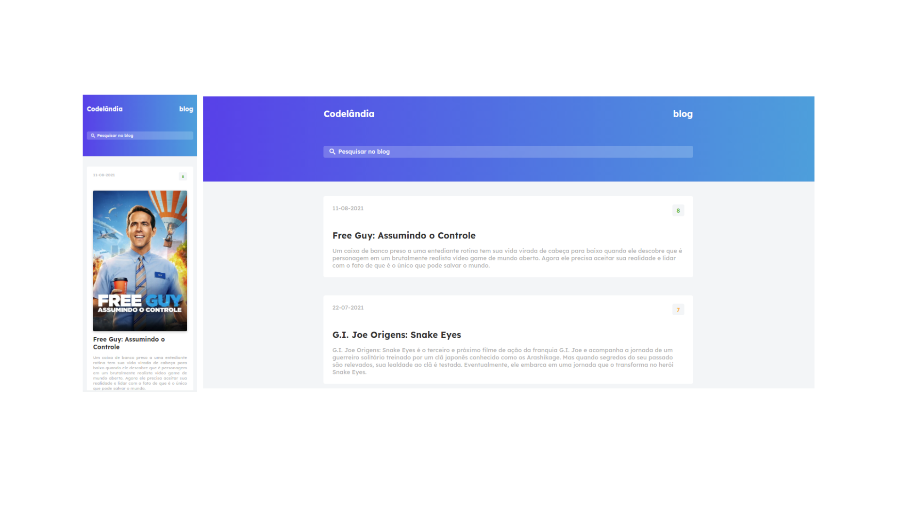

# Desafio - 01 Codelândia

💻 **Projeto feito o Front-end e Back-end**

</img>

### 📋 Aprendizado

O desafio proposto pelo comunidade **codelândia** é para que possamos praticar o Front-End conforme os layout disponibilizado para cada desafio. Neste desafio pude praticar Flex-box e javascript, onde levei como objetivo colocar dados dinâmicos para que pudesse aprender comunicações com API onde foi utilizado a API do themoviedb, onde trago as informações inicias dos filmes mais populares e também dando a possibilidade do usuário poder realizar a busca do Filme que deseja; 

### 📌 Construido com as seguites tecnologias

- Html
- Css
- JavaScript + API themoviedb

### Autor

- Linkedin - [https://www.linkedin.com/in/sergioAlmeidaa](https://www.linkedin.com/in/sergioAlmeidaa)
